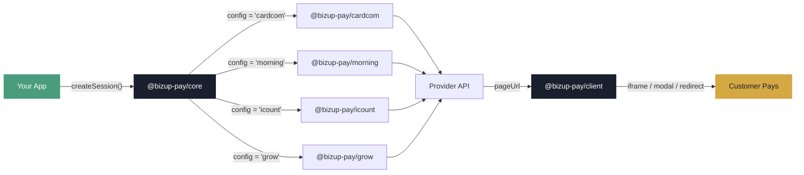

<div align="center">

# BizUp Pay

### One SDK for Every Israeli Payment Provider

Write payment code once. Swap providers by changing one line of config.<br>
TypeScript-first, framework-agnostic, production-ready.

[](https://www.npmjs.com/package/@bizup-pay/core)
[](https://github.com/bizup-dev/bizup-pay/actions?query=branch%3Amain)
[](https://opensource.org/licenses/MIT)
[](https://github.com/bizup-dev/bizup-pay)

[Documentation](https://pay.bizup.dev) · [Setup Guides](https://pay.bizup.dev/providers.html) · [GitHub](https://github.com/bizup-dev/bizup-pay) · [npm](https://www.npmjs.com/org/bizup-pay)

</div>

---

## Why BizUp Pay?

Israeli payment providers each have their own API, auth scheme, and data format. BizUp Pay gives you **one unified interface** across all of them — so you write your payment logic once and never worry about provider lock-in.

| | What you get |
|---|---|
| **Unified API** | Same 4 methods across every provider: `createSession`, `getTransaction`, `refund`, `parseWebhook` |
| **Swap in one line** | Change `createProvider('cardcom', ...)` to `createProvider('morning', ...)` — done |
| **TypeScript-first** | Full type safety, autocomplete, and provider-specific extras |
| **Framework-agnostic** | Works with Next.js, Express, Fastify, Hono, or plain Node |
| **Browser SDK** | Embed payment pages as iframe, modal, or redirect — any frontend framework |
| **Production-ready** | Structured errors, webhook parsing, refunds, transaction lookup |

## Supported Providers

| Provider | Package | Payment Page | Webhooks | Refunds | Transactions |
|----------|---------|:---:|:---:|:---:|:---:|
| [Cardcom](https://www.cardcom.solutions/) | `@bizup-pay/cardcom` | ✅ | ✅ | ✅ | ✅ |
| [Morning](https://www.greeninvoice.co.il/) (Green Invoice) | `@bizup-pay/morning` | ✅ | ✅ | ✅ | ✅ |
| [iCount](https://www.icount.co.il/) | `@bizup-pay/icount` | ✅ | ✅ | ✅ | ✅ |
| [Grow.il](https://www.grow.link/) (Meshulam) | `@bizup-pay/grow` | ✅ | ✅ | ✅ | ✅ |

<details>
<summary><strong>Payment methods by provider</strong></summary>

<br>

| Method | Morning | Cardcom | iCount | Grow |
|--------|:---:|:---:|:---:|:---:|
| Credit Card | ✅ | ✅ | ✅ | ✅ |
| Bit | ✅ | ✅ | ✅ | ✅ |
| Apple Pay | ✅ | ✅ | — | ✅ |
| Google Pay | ✅ | ✅ | — | ✅ |
| PayPal | ✅ | ✅ | ✅ | — |
| Bank Transfer | ✅ | — | — | ✅ |

Table inaccurate? [Open an issue](https://github.com/bizup-dev/bizup-pay/issues) and we'll update it.

</details>

## How It Works



**Three packages, any provider:**

| Layer | Package | Where |
|-------|---------|-------|
| **Core** | `@bizup-pay/core` | Your server — types, factory, shared logic |
| **Provider** | `@bizup-pay/cardcom` `morning` `icount` `grow` | Your server — translates to provider API |
| **Client** | `@bizup-pay/client` | Your browser — mounts payment UI |

## Quick Start

### 1. Install

```bash
npm install @bizup-pay/core @bizup-pay/cardcom
```

### 2. Create a payment session (server)

```typescript
import { createProvider } from '@bizup-pay/core'
import '@bizup-pay/cardcom'

const provider = createProvider('cardcom', {
  terminalNumber: 1000,
  apiName: process.env.CARDCOM_API_NAME!,
  apiPassword: process.env.CARDCOM_API_PASSWORD!,
})

const session = await provider.createSession({
  amount: 100,
  currency: 'ILS',
  description: 'Order #1234',
  successUrl: 'https://myshop.co.il/success',
  webhookUrl: 'https://myshop.co.il/api/webhook',
  customer: { name: 'Israel Israeli', email: 'israel@example.com' },
})

// Redirect customer to session.pageUrl
```

### 3. Handle the webhook

```typescript
const event = await provider.parseWebhook(req.body)

if (event.type === 'payment.completed') {
  await fulfillOrder(event.transaction)
}
```

## Switch Providers in One Line

Your entire payment logic stays the same — just change the import and config:

```diff
- import '@bizup-pay/cardcom'
- const provider = createProvider('cardcom', { terminalNumber: 1000, apiName: '...' })
+ import '@bizup-pay/morning'
+ const provider = createProvider('morning', { apiKey: '...', apiSecret: '...' })
```

Everything else — `createSession`, `parseWebhook`, `getTransaction`, `refund` — works identically.

## Full API

```typescript
// Create a payment page
const session = await provider.createSession({ amount, description, successUrl, webhookUrl })

// Look up a transaction
const tx = await provider.getTransaction('tx_123')
// → tx.amount, tx.status, tx.cardBrand, tx.documentUrl

// Process a refund
const refund = await provider.refund({ transactionId: 'tx_123' })

// Parse incoming webhook
const event = await provider.parseWebhook(req.body)
// → event.type, event.transaction
```

## Browser SDK

Embed the payment page in your frontend — works with React, Vue, Svelte, or vanilla JS:

```bash
npm install @bizup-pay/client
```

```typescript
import { BizupPay } from '@bizup-pay/client'

const bizupPay = new BizupPay()
bizupPay.mount(session, document.getElementById('payment'), {
  onSuccess: () => window.location.href = '/thank-you',
  onFailure: (e) => alert(e.message),
})
```

Or via CDN — no build tools required:

```html
<script src="https://cdn.jsdelivr.net/npm/@bizup-pay/client/dist/bizup-pay.min.js"></script>
```

## Packages

| Package | Description | npm |
|---------|-------------|-----|
| [`@bizup-pay/core`](packages/core) | Types, provider interface, factory | [](https://www.npmjs.com/package/@bizup-pay/core) |
| [`@bizup-pay/cardcom`](packages/cardcom) | Cardcom adapter | [](https://www.npmjs.com/package/@bizup-pay/cardcom) |
| [`@bizup-pay/morning`](packages/morning) | Morning (Green Invoice) adapter | [](https://www.npmjs.com/package/@bizup-pay/morning) |
| [`@bizup-pay/icount`](packages/icount) | iCount adapter | [](https://www.npmjs.com/package/@bizup-pay/icount) |
| [`@bizup-pay/grow`](packages/grow) | Grow.il (Meshulam) adapter | [](https://www.npmjs.com/package/@bizup-pay/grow) |
| [`@bizup-pay/client`](packages/client) | Browser SDK (iframe/modal/redirect) | [](https://www.npmjs.com/package/@bizup-pay/client) |
| [`@bizup-pay/mock-server`](packages/mock-server) | Mock servers for testing | [](https://www.npmjs.com/package/@bizup-pay/mock-server) |

<details>
<summary><strong>Development</strong></summary>

### Setup

```bash
git clone https://github.com/bizup-dev/bizup-pay.git
cd bizup-pay
npm install
npm run build
npm test          # 131 unit tests
```

### Run the demo app

```bash
# Terminal 1: mock payment servers
node packages/mock-server/dist/standalone.js

# Terminal 2: Next.js demo
cd examples/checkout-demo && npx next dev -p 3099
```

Open http://localhost:3099

### Project structure

```
packages/
  core/           # Shared types & provider factory
  cardcom/        # Cardcom adapter
  morning/        # Morning adapter
  icount/         # iCount adapter
  grow/           # Grow.il adapter
  client/         # Browser SDK
  mock-server/    # Mock servers for all providers
examples/
  checkout-demo/  # Full Next.js demo app
```

</details>

## Documentation

Full docs, provider setup guides, and examples at **[pay.bizup.dev](https://pay.bizup.dev)**

## License

[MIT](LICENSE) — Built by [BizUp.dev](https://bizup.dev)
